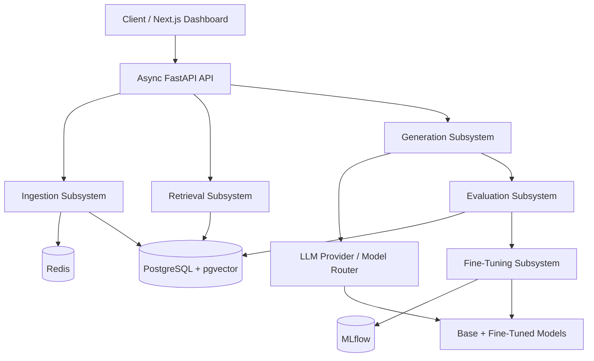
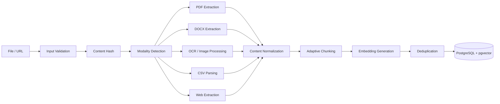
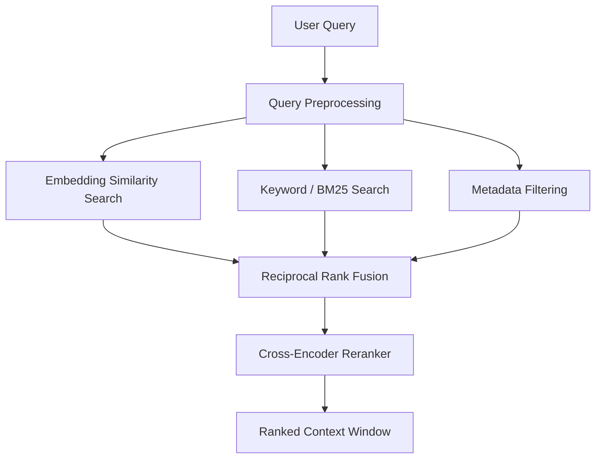
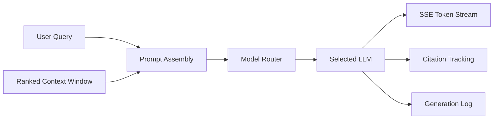
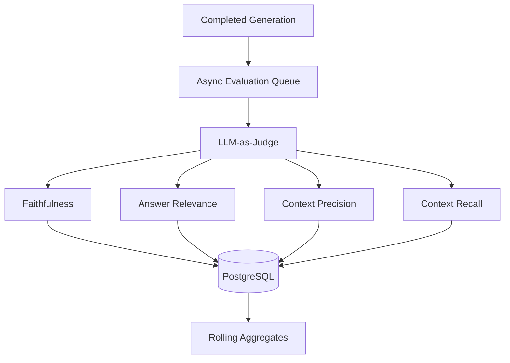
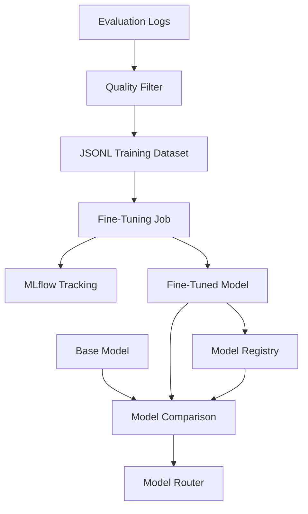

# NeuroFlow System Architecture

## 1. Overview

NeuroFlow is a production-grade multi-modal LLM orchestration platform designed to support document ingestion, hybrid retrieval, grounded generation, automated evaluation, fine-tuning, and intelligent model routing.

The system is composed of five primary subsystems:

1. Ingestion Subsystem
2. Retrieval Subsystem
3. Generation Subsystem
4. Evaluation Subsystem
5. Fine-Tuning Subsystem

The architecture is designed around asynchronous processing, modular LLM providers, PostgreSQL with pgvector, Redis-backed background processing, MLflow experiment tracking, and observable AI workflows.

## 2. High-Level Architecture



---

# 3. Ingestion Subsystem

## 3.1 Purpose

The ingestion subsystem accepts raw knowledge sources and converts them into queryable vector representations.

Supported input modalities are:

* PDF
* DOCX
* Images
* CSV
* Web URLs

The ingestion workflow performs:

1. Input validation
2. Content hashing
3. Modality detection
4. Content extraction
5. Content normalization
6. Chunking
7. Embedding generation
8. Deduplication
9. Persistence in PostgreSQL with pgvector

## 3.2 Ingestion Data Flow



## 3.3 Input Validation

The API validates:

* file type
* MIME type
* file size
* URL format
* supported modality
* authentication
* authorization
* metadata format

Invalid inputs are rejected before expensive processing begins.

## 3.4 Content Extraction

Each modality uses a specialized extraction process.

| Source  | Extraction Strategy                                |
| ------- | -------------------------------------------------- |
| PDF     | Text, pages, headings, tables where supported      |
| DOCX    | Paragraphs, headings, tables and document metadata |
| Image   | OCR and image metadata                             |
| CSV     | Structured rows, columns and metadata              |
| Web URL | HTML/content extraction and metadata               |

The original source metadata is preserved for provenance and citation purposes.

## 3.5 Content Normalization

Extracted content is normalized before chunking.

Normalization includes:

* whitespace cleanup
* encoding normalization
* removal of unnecessary markup
* preservation of meaningful headings
* preservation of source metadata
* normalization of line breaks

## 3.6 Chunking

The default strategy is adaptive sentence-aware chunking with bounded chunk size and controlled overlap.

Chunk metadata includes:

* document ID
* chunk ID
* source
* modality
* page or section
* chunk index
* content hash
* creation timestamp

The chunking strategy is documented in ADR 002.

## 3.7 Embedding Generation

Each chunk is converted into a vector embedding using the configured embedding provider.

The embedding model and embedding dimension are stored with the pipeline configuration to ensure retrieval compatibility.

## 3.8 Deduplication

NeuroFlow performs content-level deduplication using hashes.

Duplicate documents or chunks are detected before unnecessary embedding and persistence operations.

This reduces:

* storage usage
* embedding cost
* processing time
* duplicate retrieval results

## 3.9 Vector Persistence

Chunks and embeddings are stored in PostgreSQL with pgvector.

The vector store also maintains relational metadata required for filtering and provenance.

The system therefore supports:

* vector similarity search
* metadata filtering
* relational joins
* transactional persistence
* unified application storage

## 3.10 First Queryable Vector

A source becomes queryable only after the complete ingestion flow succeeds:

```text
Validated Input
      ↓
Content Extraction
      ↓
Normalization
      ↓
Chunk Creation
      ↓
Embedding Generation
      ↓
Deduplication
      ↓
PostgreSQL + pgvector
      ↓
Queryable Vector
```

---

# 4. Retrieval Subsystem

## 4.1 Purpose

The retrieval subsystem identifies the most relevant context for a user query.

It uses multiple retrieval strategies in parallel:

* embedding similarity search
* keyword search
* metadata filtering

The resulting candidates are fused using Reciprocal Rank Fusion and then reranked using a cross-encoder.

## 4.2 Retrieval Pipeline



## 4.3 Query Preprocessing

The query is validated and normalized before retrieval.

Possible preprocessing includes:

* whitespace normalization
* language detection
* metadata extraction
* query embedding generation
* filter validation

## 4.4 Vector Similarity Search

The query is converted into an embedding using the configured embedding model.

The resulting vector is compared against stored chunk embeddings using pgvector similarity search.

The search returns candidate chunks ranked by vector similarity.

## 4.5 Keyword Search

Keyword retrieval identifies documents containing relevant terms.

The implementation can use PostgreSQL full-text search or a BM25-compatible ranking approach.

Keyword search is useful when exact terms, identifiers, names, codes, or domain-specific phrases are important.

## 4.6 Metadata Filtering

Metadata filters restrict retrieval results based on structured attributes such as:

* document ID
* source
* document type
* date
* modality
* tenant
* department
* tags

Metadata filtering is applied alongside the other retrieval strategies.

## 4.7 Reciprocal Rank Fusion

The independent retrieval result lists are combined using Reciprocal Rank Fusion.

For a document at rank `r`:

```text
RRF score = 1 / (k + r)
```

where `k` is a configurable constant.

The combined score is calculated across retrieval strategies.

RRF improves robustness by allowing relevant documents found by different retrieval methods to contribute to the final candidate ranking.

## 4.8 Cross-Encoder Reranking

The top candidates from RRF are passed to a cross-encoder.

The cross-encoder evaluates the relationship between:

```text
(query, candidate_chunk)
```

and produces a relevance score.

Candidates are then reordered according to the reranker score.

## 4.9 Ranked Context Window

The final top-K chunks form the context window supplied to the generation subsystem.

Each context item retains:

* document ID
* chunk ID
* source
* page or section
* retrieval score
* reranker score

This provenance information is later used for citation tracking and evaluation.

---

# 5. Generation Subsystem

## 5.1 Purpose

The generation subsystem transforms the retrieved context into a grounded response.

Its responsibilities include:

* prompt assembly
* model routing
* LLM invocation
* streaming
* citation tracking
* generation logging

## 5.2 Generation Flow



## 5.3 Prompt Assembly

The prompt builder combines:

* system instructions
* user query
* retrieved context
* citation requirements
* pipeline configuration
* output constraints

Prompt templates are versioned so that generation results can be reproduced and evaluated against the exact configuration used.

## 5.4 Model Routing

The model router selects an appropriate LLM using multiple factors:

* capability
* cost
* latency
* domain
* context length requirements
* modality requirements
* fine-tuned model availability

The routing decision is recorded for observability and evaluation.

The detailed routing strategy is documented in ADR 004.

## 5.5 LLM Provider Abstraction

The generation subsystem does not depend directly on a single model provider.

A provider abstraction layer allows different LLM providers to expose a common interface for:

* model invocation
* streaming
* token usage
* latency measurement
* errors
* model metadata

This allows models to be added or replaced without redesigning the generation pipeline.

## 5.6 Streaming

Generation is streamed asynchronously using Server-Sent Events.

The client receives generated content incrementally instead of waiting for the complete answer.

The stream can emit events such as:

* token
* citation
* metadata
* completion
* error

## 5.7 Citation Tracking

The system associates generated claims with retrieved evidence where possible.

Citation metadata contains:

* document ID
* chunk ID
* source
* page or section
* retrieval score
* reranker score

This allows users and evaluation components to trace responses back to source evidence.

## 5.8 Generation Logging

Every completed generation is logged for evaluation.

The generation record contains:

* query
* prompt
* retrieved context
* selected model
* model configuration
* generated answer
* citations
* token usage
* latency
* pipeline ID
* timestamps
* request ID

---

# 6. Evaluation Subsystem

## 6.1 Purpose

The evaluation subsystem asynchronously evaluates every completed generation.

It measures:

* Faithfulness
* Answer relevance
* Context precision
* Context recall

Results are stored in PostgreSQL and used to calculate rolling quality aggregates.

## 6.2 Evaluation Pipeline



## 6.3 Asynchronous Evaluation

Evaluation is separated from the user-facing generation path.

After generation completes, the generation record is placed onto an asynchronous evaluation queue.

A background worker processes the evaluation without delaying the user's response.

## 6.4 Faithfulness

Faithfulness measures whether claims in the generated answer are supported by the retrieved context.

A high score indicates that the answer is grounded in available evidence.

A low score indicates that the model may have introduced unsupported claims or hallucinated information.

## 6.5 Answer Relevance

Answer relevance measures whether the generated answer directly addresses the user's question.

This metric is evaluated separately from faithfulness because an answer can be factually grounded but still fail to answer the actual question.

## 6.6 Context Precision

Context precision measures how much of the retrieved context is relevant and useful for producing the answer.

Low context precision indicates that retrieval returned excessive irrelevant information.

## 6.7 Context Recall

Context recall measures whether the retrieval system successfully retrieved the relevant information needed to answer the question.

Low context recall indicates that useful information may exist in the knowledge base but was not retrieved.

## 6.8 Evaluation Records

Each evaluation record contains:

* evaluation ID
* query ID
* generation ID
* pipeline ID
* faithfulness score
* answer relevance score
* context precision score
* context recall score
* evaluator model
* evaluator version
* evaluation timestamp
* optional user rating

## 6.9 Rolling Aggregates

NeuroFlow calculates rolling metrics over configurable time windows.

Supported aggregate views include:

* average faithfulness
* average answer relevance
* average context precision
* average context recall
* score distribution
* failure rate
* evaluation sample count

These metrics support quality monitoring and regression detection.

---

# 7. Fine-Tuning Subsystem

## 7.1 Purpose

The fine-tuning subsystem converts high-quality production interactions into training data and manages fine-tuning experiments.

The subsystem only uses interactions that satisfy the required quality threshold.

## 7.2 Fine-Tuning Pipeline



## 7.3 Training Data Selection

Only high-quality interactions are selected.

The required selection rule is:

```text
faithfulness > 0.8
AND
user rating >= 4
```

This prevents low-quality generations from becoming training examples.

## 7.4 Training Data Extraction

Selected evaluation records are transformed into prompt/completion pairs.

The resulting dataset contains:

* prompt
* completion
* source metadata
* dataset version
* creation timestamp

## 7.5 JSONL Dataset

Training examples are formatted as JSONL.

Each dataset receives a unique identifier and version so that fine-tuning experiments remain reproducible.

## 7.6 Fine-Tuning Jobs

Fine-tuning jobs execute asynchronously.

A job tracks:

* job ID
* dataset ID
* base model
* provider
* hyperparameters
* job status
* start time
* completion time
* output model

## 7.7 MLflow Tracking

MLflow tracks:

* experiment ID
* run ID
* dataset version
* base model
* hyperparameters
* training metrics
* evaluation metrics
* model artifacts

## 7.8 Model Registration

Successful models are registered with metadata including:

* model name
* model version
* base model
* training dataset
* evaluation results
* deployment status

## 7.9 Base vs Fine-Tuned Model Evaluation

A fine-tuned model is not automatically promoted.

It is evaluated against the corresponding base model using:

* faithfulness
* answer relevance
* context precision
* context recall
* task-specific quality
* latency
* cost
* reliability

The fine-tuned model becomes eligible for routing only when it meets configured quality requirements and demonstrates improvement over the base model for the relevant workload.

---

# 8. Cross-Cutting Architecture

## 8.1 Asynchronous Processing

FastAPI provides the primary asynchronous API layer.

Long-running operations such as:

* ingestion
* evaluation
* fine-tuning

are processed asynchronously using Redis-backed workers.

This prevents long-running AI operations from blocking API requests.

## 8.2 PostgreSQL and pgvector

PostgreSQL is the primary relational data store.

pgvector provides vector similarity search while PostgreSQL stores application metadata and relationships.

This reduces the number of independent infrastructure components required by the platform.

## 8.3 Redis

Redis supports:

* background job queues
* caching
* rate limiting
* transient state
* asynchronous coordination

## 8.4 MLflow

MLflow provides:

* experiment tracking
* training metadata
* model evaluation tracking
* model registration
* model lifecycle information

## 8.5 Security Boundaries

Protected APIs require authentication and authorization.

Input validation is applied before processing.

Untrusted user input and retrieved content are treated as potentially unsafe instructions.

Prompt-injection defenses are applied before untrusted content is passed into generation workflows.

Secrets are supplied through environment variables or managed secret stores and are never committed to source control.

## 8.6 Observability

The architecture is designed to support:

* structured logging
* request IDs
* distributed tracing
* API latency metrics
* retrieval latency metrics
* LLM latency metrics
* token usage
* evaluation metrics
* model routing metrics
* background job metrics

---

# 9. End-to-End RAG Request Flow

A standard RAG query follows this sequence:

```text
User
  ↓
FastAPI
  ↓
Authentication + Validation
  ↓
Query Preprocessing
  ↓
Parallel Retrieval
  ├── Vector Search
  ├── Keyword Search
  └── Metadata Filtering
  ↓
Reciprocal Rank Fusion
  ↓
Cross-Encoder Reranking
  ↓
Ranked Context Window
  ↓
Prompt Assembly
  ↓
Model Router
  ↓
Selected LLM
  ↓
SSE Streaming
  ↓
Citation Tracking
  ↓
Generation Log
  ↓
Asynchronous Evaluation
  ↓
PostgreSQL
  ↓
Rolling Quality Metrics
```

---

# 10. End-to-End Ingestion Flow

```text
File / URL
  ↓
Validation
  ↓
Content Hash
  ↓
Modality Detection
  ↓
Content Extraction
  ↓
Normalization
  ↓
Adaptive Chunking
  ↓
Embedding Generation
  ↓
Deduplication
  ↓
PostgreSQL + pgvector
  ↓
Queryable Knowledge
```

---

# 11. Architectural Principles

NeuroFlow follows these principles:

1. **Modularity** — AI providers and pipeline components should be replaceable.
2. **Asynchronous processing** — expensive workloads should not block user-facing requests.
3. **Grounded generation** — generated answers should be based on retrieved evidence.
4. **Observable AI** — model calls, retrieval operations, evaluations, and failures must be traceable.
5. **Evaluation-driven improvement** — system quality is continuously measured.
6. **Reproducibility** — prompts, models, pipelines, datasets, and evaluation versions are tracked.
7. **Security by default** — authentication, validation, secret management, and prompt-injection defenses are part of the architecture.
8. **Production resilience** — rate limiting, retries, circuit breakers, backpressure, and health checks will be introduced in later implementation tasks.
9. **Cost-aware model routing** — model selection considers capability, latency, domain, and cost.
10. **Evidence preservation** — retrieved chunks retain provenance for citation and evaluation.

---

# 12. Future Implementation Boundaries

The architecture established in this document provides the foundation for subsequent NeuroFlow tasks:

* PostgreSQL and pgvector infrastructure
* Redis and asynchronous workers
* LLM provider abstraction
* multi-modal ingestion
* hybrid retrieval
* RRF and reranking
* RAG generation and streaming
* automated evaluation
* named pipelines
* fine-tuning
* resilience
* dashboard development
* observability
* security
* testing
* containerization
* CI/CD
* cloud deployment
* documentation

This architecture is the baseline design that subsequent implementation tasks must follow unless a future Architecture Decision Record explicitly changes the decision.
